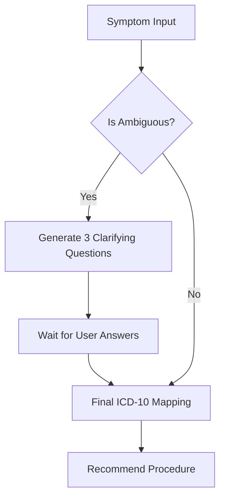

# MediRoute AI: Exhaustive Institutional Documentation

[](https://github.com/yashrao2607/Tenzorx)
[](https://github.com/yashrao2607/Tenzorx)

This document provides a **granulated technical breakdown** of the MediRoute AI ecosystem. It covers everything from the mathematical underpinnings of our auditing engine to the granular state management of the React frontend.

---

## 📖 Table of Contents
1. [Institutional Journey: Step-by-Step](#1-institutional-journey-step-by-step)
2. [Agent Intelligence: Decision Trees](#2-agent-intelligence-decision-trees)
3. [Financial Engineering & Underwriting Math](#3-financial-engineering--underwriting-math)
4. [Data Architecture (Storage Schema)](#4-data-architecture-storage-schema)
5. [Frontend Design System (Glassmorphism)](#5-frontend-design-system-glassmorphism)
6. [API Reference (Exhaustive)](#6-api-reference-exhaustive)
7. [Troubleshooting & Dev-Ops](#7-troubleshooting--dev-ops)

---

## 1. Institutional Journey: Step-by-Step

### Phase 1: Identity & KYC (`/register`)
- **Action**: User enters Aadhaar, PAN, and City.
- **Logic**: The system validates Aadhaar using the **Verhoeff Algorithm** (simulated) and PAN via standard regex `[A-Z]{5}[0-9]{4}[A-Z]{1}`.
- **Goal**: Establish a unique `user_id` linked to a regional market.

### Phase 2: Agentic Clinical Intake (`/mediroute`)
- **Action**: User describes symptoms.
- **AI Logic**: 
    1. **Intent Extraction**: Gemini identifies if the input is a symptom, a procedure name, or a general query.
    2. **Clarification**: If intent is ambiguous, the **Diagnostician Agent** pauses the flow to ask 3 targeted questions.
    3. **ICD-10 Resolution**: Mapping results to standardized codes (e.g., *Chest Pain* -> `I20.9`).

### Phase 3: Regional Market Auditing (`/hospitals`)
- **Action**: User views a map of hospitals.
- **Transparency Engine**: 
    - Fetches 400+ national records.
    - Filters by `user.city` and `diagnosis.procedure`.
    - **Anomaly Highlighting**: Hospitals priced >25% above the city median are marked with a "Price Alert" icon.

### Phase 4: Financial Underwriting (`/loan`)
- **Action**: User applies for a loan for the selected hospital.
- **Underwriting Logic**: Checks `Requested_Amount` vs `Fair_Market_Price`. 
- **Result**: Instant "APPROVED", "ADJUSTED", or "REJECTED" decision based on price integrity.

---

## 2. Agent Intelligence: Decision Trees

### A. Diagnostician Agent (Gemini 2.0 Flash)


### B. Cost Auditor Agent (Audit Engine)
```python
# The Audit Algorithm
def calculate_fair_price(median_city_cost, comorbidities):
    risk_weight = 1.0
    if "Diabetes" in comorbidities: risk_weight += 0.15
    if "Hypertension" in comorbidities: risk_weight += 0.10
    
    fair_market_price = median_city_cost * risk_weight
    return fair_market_price
```

---

## 3. Financial Engineering & Underwriting Math

MediRoute uses a **Tolerance-Based Underwriting** model. Unlike banks that only look at CIBIL, we look at **Price Integrity**.

| Metric | Formula | Description |
| :--- | :--- | :--- |
| **Overpricing %** | `(Hosp_Cost - Fair_Price) / Fair_Price * 100` | Measures hospital price gouging. |
| **Approval Limit** | `Fair_Price * 1.15` | We approve up to 15% above Fair Price. |
| **PM-JAY Gap** | `Total_Cost - Insurance_Coverage` | The actual loan amount requested. |

**Decision Matrix**:
- **0% - 10% Overpricing**: Instant Approval (Low Risk).
- **10% - 25% Overpricing**: Conditional Approval (Medium Risk).
- **> 25% Overpricing**: Flagged for Review (Potential Fraud/Billing Anomaly).

---

## 4. Data Architecture (Storage Schema)

All data is persisted in the `storage/` directory in a high-portability JSON format.

### `searches.json`
Stores the history of clinical analyses.
```json
{
  "search_id": "SRCH-12345",
  "user_id": "USR-67890",
  "symptom_text": "Severe abdominal pain",
  "diagnosis": {
    "condition": "Acute Appendicitis",
    "icd10": "K35.8",
    "procedure": "Appendectomy"
  },
  "timestamp": "2024-05-03T10:00:00Z"
}
```

---

## 5. Frontend Design System (Glassmorphism)

MediRoute utilizes a **Premium Dark/Light Glassmorphism** aesthetic.
- **Glass Card**: `backdrop-blur-md bg-white/70 border-white/20`.
- **Primary Color**: `#4F46E5` (Institutional Indigo).
- **Animations**:
    - `AnimatePresence`: For seamless page transitions.
    - `Layout Transitions`: Cards "pop" into existence when data is loaded.
    - `Marquee`: Infinite scroll for medical specialties using `framer-motion`.

---

## 6. API Reference (Exhaustive)

### `POST /api/analyze-intent`
Identifies what the user is looking for before running heavy AI agents.
- **Request**: `{ "text": "I need heart surgery" }`
- **Response**: `{ "intent": "procedure", "entity": "Heart Surgery" }`

### `POST /api/get-questions`
Generates the 3 clarifying questions for the intake flow.
- **Request**: `{ "concern": "Stomach pain" }`
- **Response**: `{ "questions": ["Is it sharp?", "Location?", "Fever?"] }`

### `POST /api/hospitals-by-city`
The core market-map endpoint.
- **Logic**: Aggregates all hospitals in a city, calculates min/max/median, and attaches a "Quality Score" to each.

---

## 7. Troubleshooting & Dev-Ops

### Port Conflicts
The project defaults to **8011** for the backend to avoid common port 8000/8001 conflicts. If you need to change it, update `config.py` and the frontend `.env`.

### Latency Tuning
If Gemini is slow:
1. Ensure `GEMINI_MODEL` is set to `gemini-2.0-flash`.
2. Check your API quota.
3. The backend uses `ainvoke` (Async Invoke) to prevent blocking the event loop.

---

**MediRoute AI** - *The Future of Institutional Transparency.*
*Documentation maintained by the TenzorX Team.*
