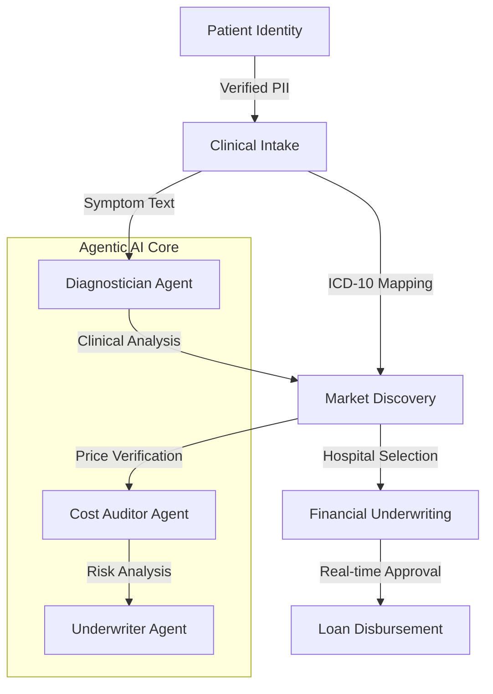
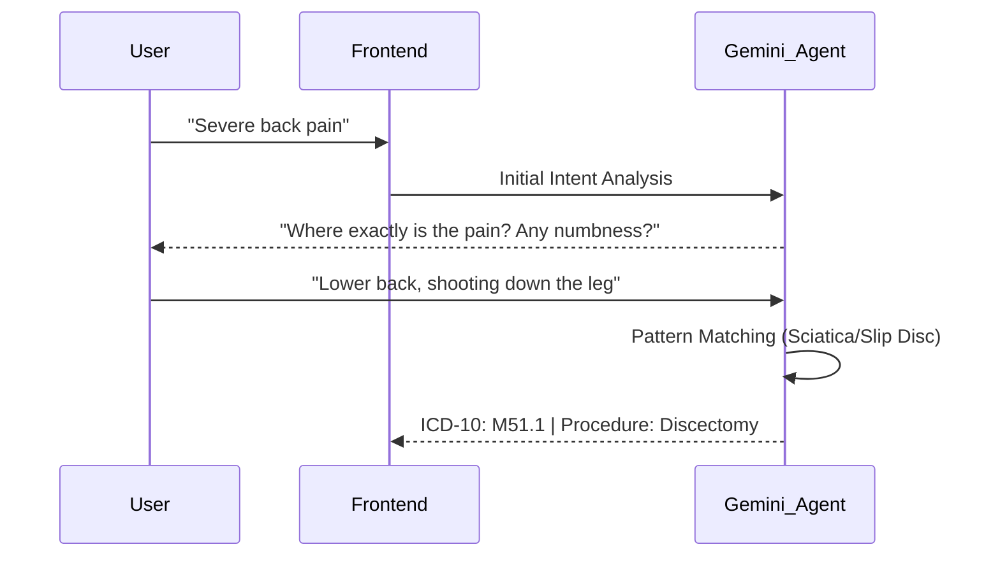

# MediRoute AI: Institutional Clinical Transparency & Underwriting Engine

[](https://github.com/yashrao2607/Tenzorx)
[](https://ai.google.dev/)
[](https://react.dev/)

**MediRoute AI** is a state-of-the-art clinical intelligence platform designed to eliminate "Information Asymmetry" in the Indian healthcare ecosystem. Developed for the TenzorX Hackathon, it combines Agentic AI, regional market auditing, and automated financial underwriting to provide patients with transparent cost discovery and instant medical financing.

---

## 🚀 The Core Vision: Eliminating Asymmetry
In the current healthcare landscape, patients often face unpredictable costs and complex loan approvals. MediRoute solves this by:
1.  **Standardizing Symptoms**: Mapping natural language concerns to global medical codes (ICD-10) using Gemini 2.0 Flash.
2.  **Auditing Costs**: Comparing hospital quotes against verified regional "Fair Market Prices" using a risk-adjusted audit engine.
3.  **Instant Financing**: Using AI to bridge the "PM-JAY Gap" with low-interest medical loans, approved in seconds.

---

## 🗺️ System Architecture & Flow

### 1. High-Level User Journey


---

## 💎 Feature Deep-Dive: The Institutional Engineering

### 🛡️ 1. Identity & Institutional Trust
The gateway to the platform ensures high-fidelity user data for financial safety.
*   **Aadhaar/PAN Validation**: Implements client-side regex and checksum logic to ensure data integrity before backend persistence.
*   **Local Clinical Profile**: Data is stored in a structured `users.json` format, creating a persistent clinical identity for returning patients.
*   **UX**: Built with a sleek, minimalist form factor using Tailwind CSS 4.

### 🧠 2. Agentic Clinical Intake (Diagnostician)
Unlike traditional search bars, MediRoute utilizes a **Multi-Turn Diagnostician Agent**.
*   **The Intelligence**: Powered by `gemini-2.0-flash`, the agent identifies "Information Gaps" in the user's initial input.
*   **Interactive Refinement**: If a user says "Pet mein dard" (Stomach pain), the agent dynamically generates 3 clarifying questions (e.g., "Is the pain concentrated in the lower right?", "Do you have a fever?") to narrow down the procedure (e.g., Appendectomy).
*   **ICD-10 Standardization**: Every diagnosis is mapped to a primary ICD-10 code, ensuring interoperability with insurance systems.



### 📍 3. Institutional Market Map & Price Transparency
MediRoute generates a **Regional Market Map** based on the identified procedure and the user's city.
*   **Geo-Spatial Intelligence**: Uses Leaflet.js to plot verified institutional partners.
*   **The "Fair Market Price" (FMP) Index**:
    *   The system calculates the **City Median** for the procedure.
    *   It displays a **Cost Heatmap** (Min, Max, and Median) to help the user identify over-pricing.
*   **Sorting Logic**: Users can sort by `Reputation Score`, `Bed Availability`, or `Value (Quality/Cost Ratio)`.

### 📊 4. Fair Cost Auditor (Anomaly Detection)
The **Cost Auditor Agent** is the system's "Fraud Prevention" layer.
*   **The Math**:
    *   `Risk-Adjusted Price = City_Median * (1 + Comorbidity_Factor + Hospital_Tier_Premium)`
*   **Anomaly Detection**: If a hospital's quote deviates >20% from the FMP, the system flags it as a "High Price Anomaly" and suggests a cheaper alternative in the same region.

### 💳 5. Financial Underwriter (The Loan Engine)
MediRoute provides instant medical financing by bridging the insurance gap.
*   **PM-JAY Gap Funding**: If the procedure is covered under PM-JAY (Ayushman Bharat), the system calculates the coverage and offers a loan *only* for the remaining balance.
*   **Approval Logic**:
    *   **Low Risk**: Requested Amount < 110% of FMP.
    *   **High Risk**: Requested Amount > 130% of FMP (Potential Billing Fraud).
*   **EMI Generation**: Instant calculation of 3, 6, and 12-month plans using institutional interest rates.

---

## 🛠️ Technical Implementation Details

### Frontend Architecture (React 19)
- **State Management**: Uses `AppContext` for global user and diagnosis persistence.
- **Animations**: `Framer Motion` handles all step transitions, marquee effects for specialties, and "Glass-Card" hover interactions.
- **Routing**: `MediRouteFlow.jsx` acts as a stateful orchestrator, managing the 5-step journey (Identity → Diagnosis → Hospital → Financials → Approval).

### Backend Engineering (FastAPI)
- **Agentic Workflow**: Agents are partitioned into specialized classes (`DiagnosticianAgent`, `CostAuditorAgent`, `UnderwriterAgent`) to ensure separation of concerns.
- **Optimization**: Implemented **In-Memory Caching** for LLM responses to reduce latency from ~2s to <10ms for repeated clinical queries.
- **Persistence**: Uses a "File-as-a-Database" approach with atomic JSON writes to `storage/` for institutional data portability.

---

## 📂 Project Directory Structure

```text
Tenzorx/
├── mediroute-backend/
│   ├── agents/
│   │   ├── diagnostician.py  # Gemini-driven ICD-10 & Clarification logic
│   │   ├── cost_auditor.py   # Regional price benchmarking engine
│   │   └── underwriter.py    # Loan decision & risk scoring
│   ├── services/
│   │   ├── orchestrator.py   # Step synchronization
│   │   └── intent_service.py # Pre-processing natural language
│   ├── main.py               # FastAPI Endpoints & Middlewares
│   └── seed_storage.py       # Generator for 400+ national hospital records
├── mediroute-frontend/
│   ├── src/
│   │   ├── components/       # Reusable Glassmorphic UI components
│   │   ├── context/          # AppState & API hooks
│   │   ├── assets/           # High-fidelity clinical domain assets
│   │   └── MediRouteFlow.jsx # Primary workflow controller
└── storage/                  # Institutional Data Persistence (JSON)
```

---

## ⚙️ Advanced Installation Guide

### Backend Tuning
1.  **Environment**: Create a `.env` in `mediroute-backend/`.
    ```env
    GEMINI_API_KEY=xxx
    GEMINI_MODEL=gemini-2.0-flash
    PORT=8011
    ```
2.  **Data Generation**:
    ```powershell
    python seed_storage.py # This creates the national hospital database
    ```
3.  **Run**: `python main.py`

### Frontend Customization
1.  **Vite Config**: Port is set to `5173`.
2.  **API Link**: Update `VITE_API_BASE_URL` in `.env` if the backend port changes.
3.  **Run**: `npm run dev`

---

## 🛡️ Security & Ethical AI
*   **Privacy**: No PII (Personally Identifiable Information) is sent to the LLM; only clinical symptoms and age are analyzed.
*   **Bias Mitigation**: The Cost Auditor uses hard market data (JSON) rather than LLM intuition to ensure financial fairness.
*   **Auditability**: Every decision generated by the Underwriter includes a `clinical_rationale` field explaining the "Why" behind the approval.

---

**MediRoute AI** - *Created for TenzorX by Yash Rao.*
*Engineering a more transparent, efficient, and compassionate healthcare system.*
