# MediRoute AI

## Institutional Clinical Transparency and Medical Underwriting Engine

MediRoute AI is a full-stack healthcare transparency platform built for the
TenzorX Hackathon. It helps a patient move from "I have symptoms" to "I know
the likely procedure, fair hospital price, nearby hospital options, and loan
decision" in one guided flow.

The project is designed for two audiences:

- Patients and non-technical users who need clear medical-cost guidance.
- Lenders, hospitals, and reviewers who need auditable decision logic.

In simple words: MediRoute is like a healthcare navigation desk. The patient
describes their problem, the system asks better questions, maps the concern to a
likely medical procedure, compares hospital costs in the selected city, and then
checks whether the requested medical loan looks fair or risky.

---

## Table of Contents

- [Problem](#problem)
- [Solution](#solution)
- [Key Features](#key-features)
- [Plain-English User Journey](#plain-english-user-journey)
- [System Architecture](#system-architecture)
- [Complete Application Flow](#complete-application-flow)
- [AI Agent Flow](#ai-agent-flow)
- [Backend API Flow](#backend-api-flow)
- [Frontend Flow](#frontend-flow)
- [Data and Storage Design](#data-and-storage-design)
- [Loan Decision Logic](#loan-decision-logic)
- [Security, Privacy, and Trust](#security-privacy-and-trust)
- [Tech Stack](#tech-stack)
- [Project Structure](#project-structure)
- [Setup and Run Locally](#setup-and-run-locally)
- [Docker Setup](#docker-setup)
- [API Reference](#api-reference)
- [Testing and CI](#testing-and-ci)
- [Known Limitations](#known-limitations)
- [Future Scope](#future-scope)

---

## Problem

Healthcare decisions are stressful because patients often do not know:

- Which condition or procedure their symptoms may point to.
- Whether a hospital estimate is normal or overpriced.
- How much of the cost might remain after coverage.
- Whether a loan request is financially reasonable.
- Why a lender approved, reviewed, or rejected a request.

This creates information asymmetry: hospitals and lenders have more structured
information than patients do.

MediRoute AI reduces that gap by making the decision chain visible.

---

## Solution

MediRoute AI combines:

- A patient-facing React app.
- A FastAPI backend.
- A clinical AI diagnostician agent.
- A cost auditor that benchmarks hospital pricing.
- A loan underwriter that checks pricing fairness and repayment risk.
- Local JSON audit logs and database support for hospital data.

The product does not claim to replace a doctor. It helps users understand the
likely direction, compare prices, and produce a transparent underwriting record.

---

## Key Features

### 1. Patient identity and profile

The app collects identity and basic profile information before the guided flow.
The backend validates:

- Aadhaar format and checksum using the Verhoeff algorithm.
- Indian mobile number format.
- PAN format.
- Optional ABHA ID based mock health-record lookup.

### 2. AI-guided disease and procedure search

The patient enters symptoms in natural language. The diagnostician can:

- Ask three clarifying questions.
- Use optional clinical history such as diabetes, hypertension, previous
  surgeries, or other comorbidities.
- Return a likely condition, ICD-10 code, recommended procedure, confidence
  score, and clinical rationale.

### 3. Hospital and market discovery

The backend searches hospital data by:

- City.
- ICD-10 code.
- Procedure.
- Fuzzy city/procedure matching when exact values are unavailable.

The frontend shows hospital options and cost information, including map-based
views through Leaflet.

### 4. Fair market price calculation

MediRoute calculates a fair market benchmark from hospital data and adjusts it
for risk factors such as:

- Diabetes.
- Hypertension.
- Heart disease.
- Obesity.
- Other comorbidities with fallback multipliers.

### 5. Medical underwriting and loan decision

The loan engine compares requested cost against fair market cost. It computes:

- Insurance coverage simulation.
- Gap loan amount.
- Overpricing percentage.
- Fairness score.
- Fraud risk score.
- EMI options.
- Cheaper hospital alternatives when available.

### 6. Lender audit dashboard

The lender side can read recent loan decision logs so financial reviewers can
see why a case was approved, sent to review, or rejected.

---

## Plain-English User Journey

Imagine a patient with stomach pain:

1. The patient registers with basic identity details.
2. The patient describes symptoms, for example "severe pain in lower abdomen".
3. The AI asks follow-up questions.
4. The AI suggests a likely condition and procedure, such as appendicitis and
   appendectomy.
5. The app shows hospitals in the patient's city that provide that procedure.
6. The system calculates the fair market price for that procedure.
7. The patient selects a hospital and enters financial details.
8. The backend estimates insurance coverage and the remaining loan gap.
9. The final screen shows approval, review, or rejection with reasons.
10. The decision is stored for audit.

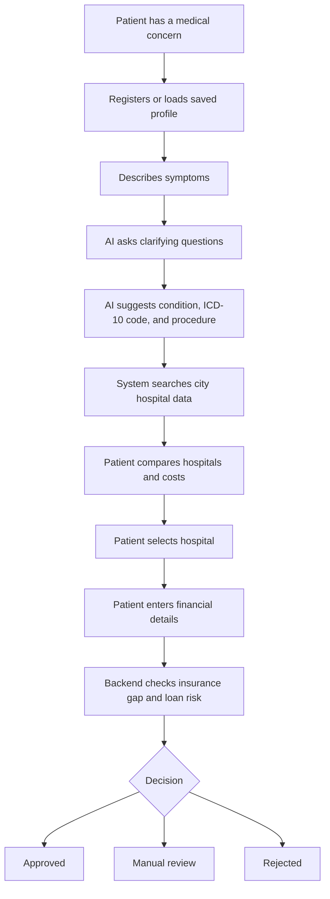

---

## System Architecture

At a high level, the browser talks to the FastAPI backend. The backend talks to
AI services, hospital data, database tables, and JSON audit files.

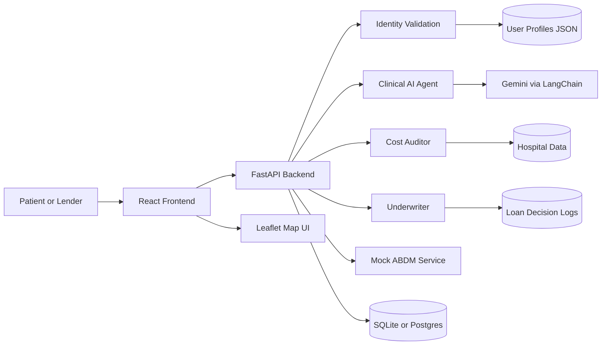

### Architecture for non-technical readers

- Frontend: what the user sees and clicks.
- Backend: the decision engine behind the screen.
- AI agent: reads symptoms and produces medical reasoning.
- Hospital data: contains city, procedure, price, tier, and reputation details.
- Underwriter: checks if the loan amount is fair compared with market cost.
- Audit logs: keep a record of important searches and loan decisions.

---

## Complete Application Flow

This diagram shows the main product route at `/mediroute`.

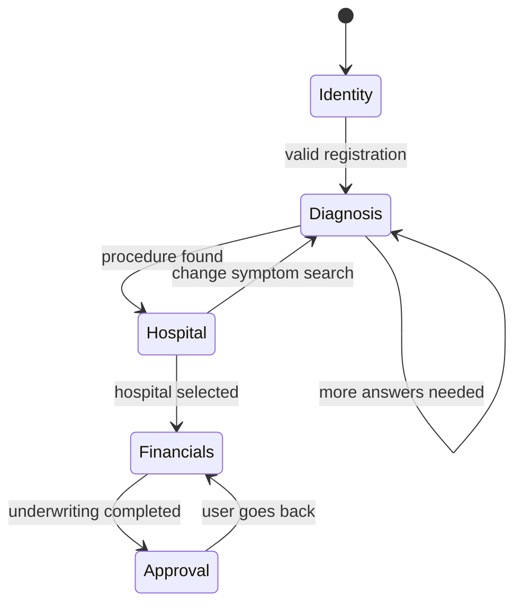

### Main flow in code

The guided flow lives in:

- `mediroute-frontend/src/MediRouteFlow.jsx`
- `mediroute-frontend/src/components/RegistrationForm.jsx`
- `mediroute-frontend/src/components/DiseaseSearch.jsx`
- `mediroute-frontend/src/components/HospitalMapView.jsx`
- `mediroute-frontend/src/components/FinancialForm.jsx`
- `mediroute-frontend/src/components/LoanDecision.jsx`

---

## AI Agent Flow

MediRoute separates clinical reasoning, price audit, and underwriting into
different responsibilities.

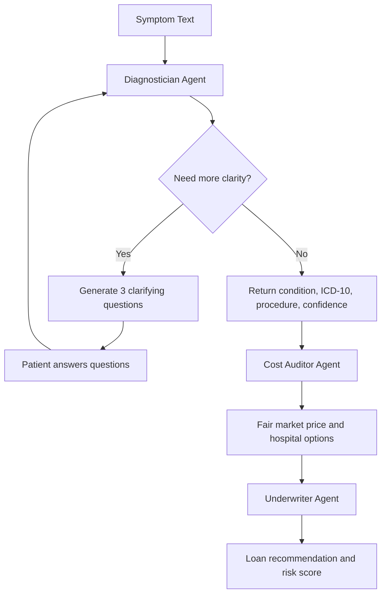

### Agent responsibilities

| Agent | File | Job |
| --- | --- | --- |
| Diagnostician | `mediroute-backend/agents/diagnostician.py` | Converts symptom text and answers into condition, ICD-10 code, recommended procedure, confidence, and rationale. |
| Cost Auditor | `mediroute-backend/agents/cost_auditor.py` | Compares procedure pricing against market data and adjusts for comorbidities. |
| Underwriter | `mediroute-backend/agents/underwriter.py` | Compares requested loan amount to risk-adjusted fair cost and recommends approve, review, or reject. |

---

## Backend API Flow

The backend is a FastAPI application in `mediroute-backend/main.py`.

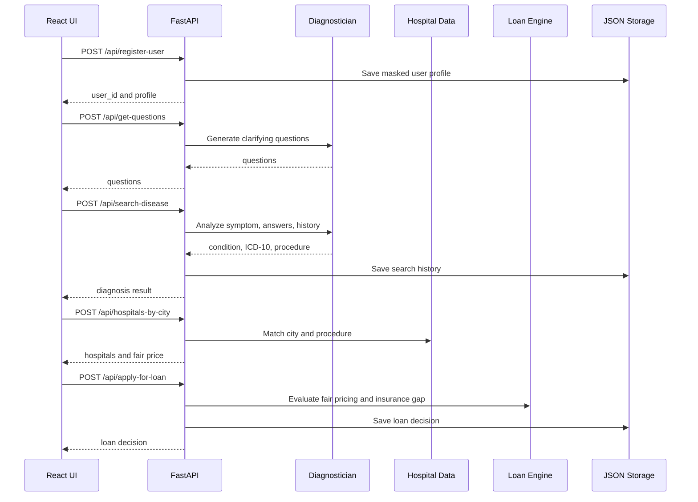

---

## Frontend Flow

The frontend is a React 19 and Vite application.

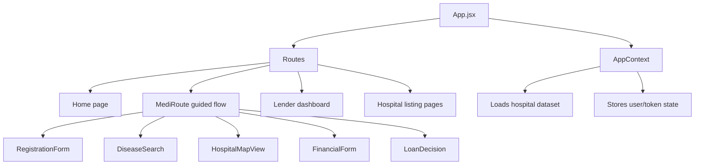

### Frontend routes

| Route | Purpose |
| --- | --- |
| `/` | Main home page. |
| `/mediroute` | Patient guided journey. |
| `/lender` | Lender audit dashboard. |
| `/doctors` | Hospital listing using the original doctor-style route. |
| `/doctors/:speciality` | Filtered hospital/speciality listing. |
| `/about` | About page. |
| `/contact` | Contact page. |
| `/login` | Login screen. |
| `/my-profile` | User profile page. |
| `/my-appointments` | Appointment history style page. |
| `/appointment/:docId` | Appointment detail route. |
| `/verify` | Verification page. |

---

## Data and Storage Design

The project uses both structured database models and portable JSON files.

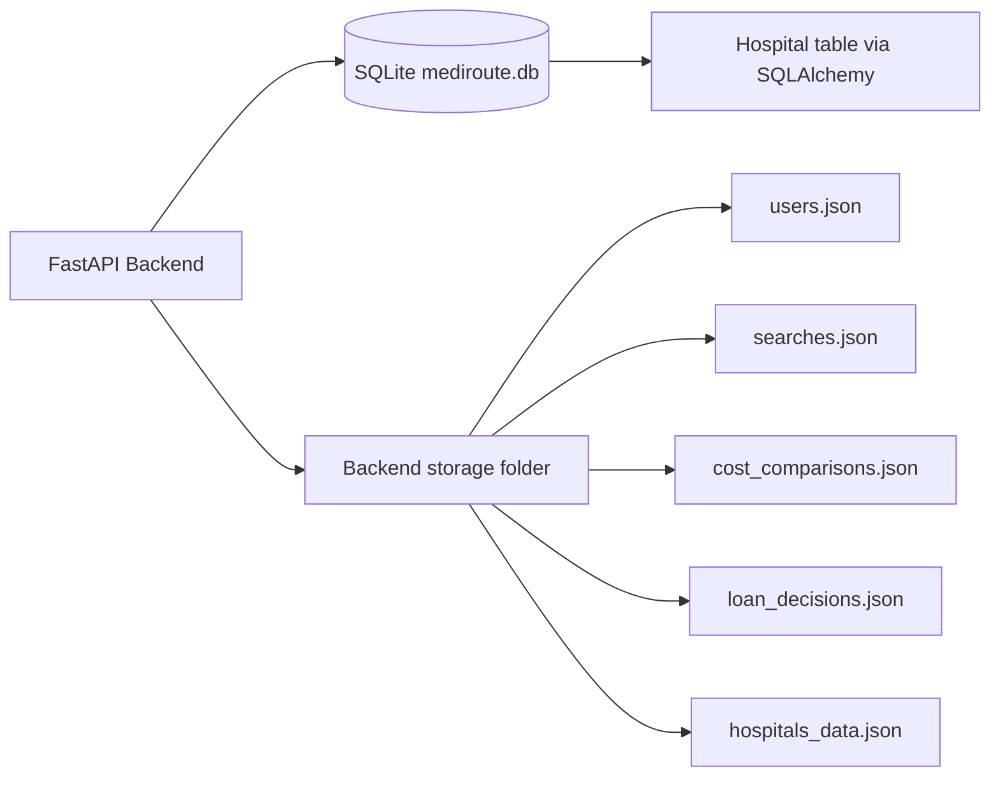

### Storage files

| File | Purpose |
| --- | --- |
| `mediroute-backend/storage/users.json` | Registered user profiles with masked Aadhaar. |
| `mediroute-backend/storage/searches.json` | Symptom search history and diagnosis output. |
| `mediroute-backend/storage/cost_comparisons.json` | Fair price calculation audit trail. |
| `mediroute-backend/storage/loan_decisions.json` | Loan decisions for lender review. |
| `mediroute-backend/storage/hospitals_data.json` | Hospital market dataset used by city/procedure search. |
| `mediroute-backend/mediroute.db` | Local SQLite database. |

### Entity relationship overview

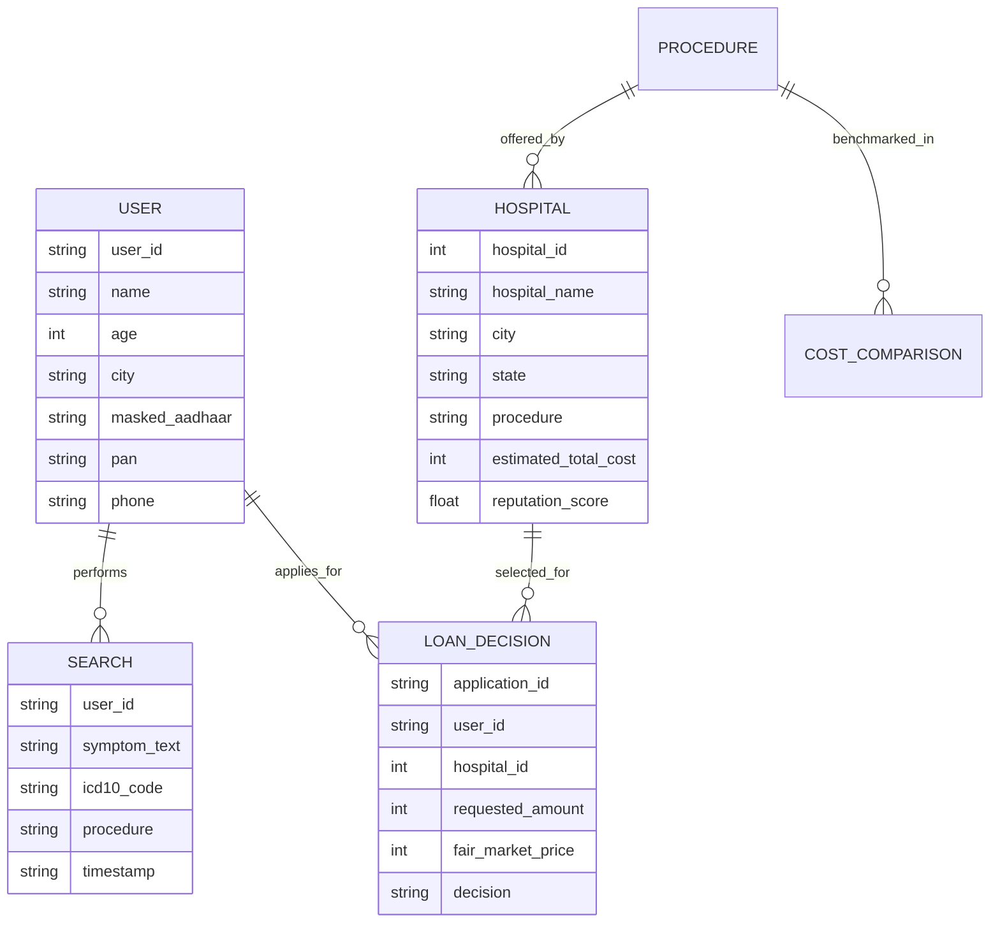

---

## Loan Decision Logic

The loan decision combines medical-price fairness and financial affordability.

### Medical price fairness

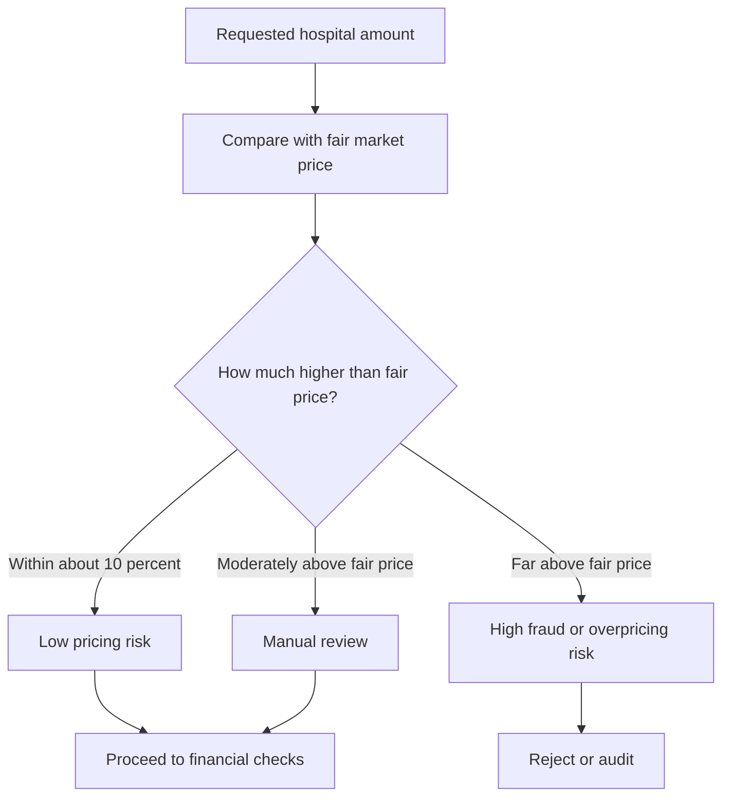

### Financial risk checks

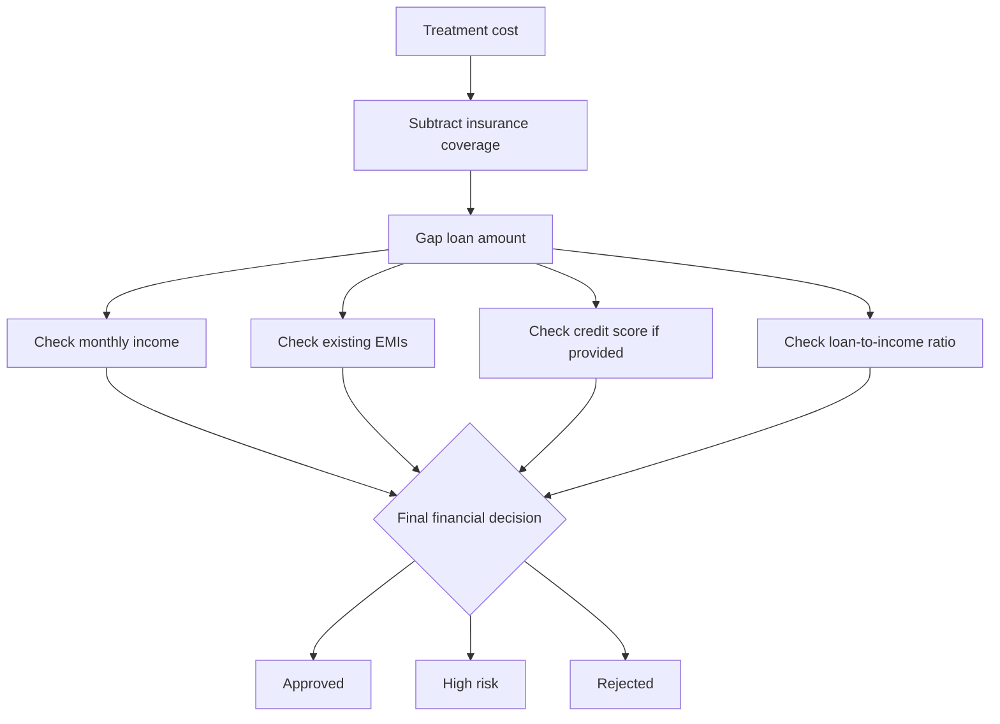

### Decision outputs

The final loan screen can show:

- Approval status.
- Confidence score.
- Approved amount.
- EMI plans.
- Insurance coverage estimate.
- Gap loan amount.
- Overpricing percentage.
- Fairness score.
- Fraud risk score.
- Cheaper alternative hospital, if available.

---

## Security, Privacy, and Trust

MediRoute includes several trust-oriented design choices:

- Aadhaar is validated, then stored in masked form.
- PAN and phone inputs are validated before user registration is accepted.
- Security headers are added by FastAPI middleware:
  - `X-Content-Type-Options`
  - `X-Frame-Options`
  - `X-XSS-Protection`
  - `Strict-Transport-Security`
- CORS is configurable through backend settings.
- Search and loan decisions are stored as audit trails.
- The ABDM integration is mocked for development and demo safety.

Important note: this is a hackathon/demo project. Production healthcare use
would require stronger consent, encryption, access control, clinical validation,
regulatory review, and real ABDM integration.

---

## Tech Stack

### Frontend

| Technology | Purpose |
| --- | --- |
| React 19 | User interface. |
| Vite | Frontend development and build tool. |
| Tailwind CSS | Styling. |
| React Router | Page routing. |
| Axios | API calls. |
| Framer Motion | Transitions and animations. |
| Leaflet and React Leaflet | Hospital map views. |
| Recharts | Charts and dashboards. |
| Lucide React | Icons. |
| React Toastify | Notifications. |

### Backend

| Technology | Purpose |
| --- | --- |
| FastAPI | REST API server. |
| Uvicorn | ASGI runtime. |
| Pydantic | Request and settings validation. |
| SQLAlchemy | Database models and access. |
| SQLite | Local development database. |
| PostgreSQL | Docker-compose database service. |
| LangChain Google GenAI | Gemini model integration. |
| RapidFuzz | Fuzzy matching for city/procedure fallback. |
| Pytest | Backend testing. |

### AI and data

| Component | Purpose |
| --- | --- |
| Gemini model | Clinical question and diagnosis generation. |
| Mock ABDM registry | Demo health-record lookup by ABHA ID. |
| JSON storage | Portable logs and audit data. |
| Hospital dataset | City and procedure based price comparison. |

---

## Project Structure

```text
Tenzorx/
|-- README.md
|-- DOCUMENTATION.md
|-- MASTER_PLAN.md
|-- MediRoute_PRD_TenzorX.md
|-- docker-compose.yml
|-- .github/
|   `-- workflows/
|       `-- ci.yml
|-- mediroute-backend/
|   |-- main.py
|   |-- config.py
|   |-- database.py
|   |-- models.py
|   |-- requirements.txt
|   |-- Dockerfile
|   |-- seed.py
|   |-- seed_storage.py
|   |-- storage_utils.py
|   |-- hospitals.json
|   |-- mediroute.db
|   |-- agents/
|   |   |-- diagnostician.py
|   |   |-- cost_auditor.py
|   |   `-- underwriter.py
|   |-- services/
|   |   |-- abdm_service.py
|   |   |-- cost_service.py
|   |   |-- intent_service.py
|   |   |-- loan_service.py
|   |   |-- ollama_service.py
|   |   |-- orchestrator.py
|   |   `-- pricing_service.py
|   |-- storage/
|   |   |-- users.json
|   |   |-- searches.json
|   |   |-- cost_comparisons.json
|   |   |-- loan_decisions.json
|   |   `-- hospitals_data.json
|   `-- tests/
|       |-- test_abdm.py
|       |-- test_clinical_context.py
|       |-- test_fairness_logic.py
|       |-- test_full_analysis.py
|       |-- test_main.py
|       |-- test_ollama.py
|       `-- test_pricing.py
`-- mediroute-frontend/
    |-- package.json
    |-- vite.config.js
    |-- tailwind.config.js
    |-- Dockerfile
    |-- src/
    |   |-- App.jsx
    |   |-- MediRouteFlow.jsx
    |   |-- main.jsx
    |   |-- context/
    |   |   `-- AppContext.jsx
    |   |-- components/
    |   |   |-- RegistrationForm.jsx
    |   |   |-- DiseaseSearch.jsx
    |   |   |-- HospitalMapView.jsx
    |   |   |-- FinancialForm.jsx
    |   |   |-- LoanDecision.jsx
    |   |   |-- LenderDashboard.jsx
    |   |   |-- CostDashboard.jsx
    |   |   `-- TopHospitals.jsx
    |   |-- pages/
    |   `-- assets/
    `-- public/
```

---

## Setup and Run Locally

### Prerequisites

Install:

- Python 3.11 or newer.
- Node.js 18 or newer.
- npm.
- Optional: Docker Desktop.
- Optional: a Gemini API key for AI-powered diagnosis.

### 1. Clone or open the project

```bash
cd Tenzorx
```

### 2. Backend setup

```bash
cd mediroute-backend
python -m venv .venv
.venv\Scripts\activate
pip install -r requirements.txt
```

Create or update `mediroute-backend/.env`:

```env
APP_NAME=MediRoute AI API
DEBUG=True
VERSION=2.0.0
HOST=0.0.0.0
PORT=8011
GEMINI_API_KEY=your_gemini_api_key_here
GEMINI_MODEL=gemini-2.5-flash
DATABASE_URL=sqlite:///./mediroute.db
ALLOWED_ORIGINS=["*"]
```

Seed hospital storage if needed:

```bash
python seed_storage.py
```

Run the backend:

```bash
python main.py
```

Backend URL:

```text
http://localhost:8011
```

FastAPI docs:

```text
http://localhost:8011/docs
```

### 3. Frontend setup

Open another terminal:

```bash
cd mediroute-frontend
npm install
```

Optional frontend env file:

```env
VITE_API_BASE_URL=http://localhost:8011
VITE_BACKEND_URL=http://localhost:8011
```

Run the frontend:

```bash
npm run dev
```

Frontend URL is usually:

```text
http://localhost:5173
```

---

## Docker Setup

The repository includes a `docker-compose.yml` with:

- PostgreSQL database.
- Backend API container.
- Frontend container.

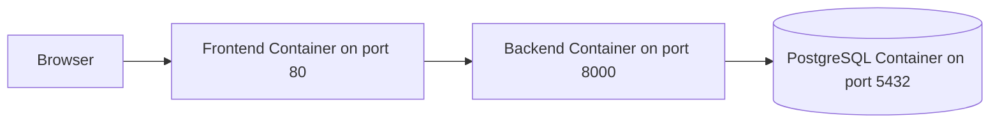

Run:

```bash
docker compose up --build
```

Expected services:

| Service | Port |
| --- | --- |
| Frontend | `80` |
| Backend | `8000` in Docker compose |
| PostgreSQL | `5432` |

Note: local development defaults to backend port `8011`, while Docker compose
maps backend port `8000`. Keep frontend environment variables aligned with the
mode you use.

---

## API Reference

### Health and root

| Method | Endpoint | Purpose |
| --- | --- | --- |
| GET | `/` | API welcome response. |
| GET | `/health` | Health check and version. |

### Identity and user profile

| Method | Endpoint | Purpose |
| --- | --- | --- |
| POST | `/api/register-user` | Register a user after Aadhaar, PAN, and phone validation. |
| POST | `/api/abdm/fetch-records` | Fetch mock ABDM health records by ABHA ID. |
| GET | `/api/get-user-profile/{user_id}` | Load one user profile. |
| GET | `/api/get-user-history/{user_id}` | Load searches and loan decisions for a user. |

### Clinical analysis

| Method | Endpoint | Purpose |
| --- | --- | --- |
| POST | `/api/get-questions` | Generate clarifying questions for a concern. |
| POST | `/api/search-disease` | Analyze symptoms, answers, and optional clinical history. |
| POST | `/api/analyze-symptom` | Direct diagnostician-agent symptom analysis. |
| POST | `/api/analyze-intent` | Earlier intent-analysis endpoint. |
| POST | `/api/full-analysis` | Runs diagnosis, cost audit, and underwriting in one pipeline. |

### Hospital and pricing

| Method | Endpoint | Purpose |
| --- | --- | --- |
| GET | `/api/hospitals` | Return all hospital records. |
| POST | `/api/hospitals-by-city` | Return procedure-specific hospitals and fair market pricing. |
| POST | `/api/estimate-cost` | Estimate costs through service layer. |
| POST | `/api/cost-analysis` | Run cost-auditor analysis for a procedure and city. |
| POST | `/api/update-comorbidity` | Recalculate costs after comorbidity changes. |

### Loan and lender

| Method | Endpoint | Purpose |
| --- | --- | --- |
| POST | `/api/apply-loan` | Earlier loan-service endpoint. |
| POST | `/api/apply-for-loan` | Main medical loan underwriting endpoint. |
| POST | `/api/analyze-financials` | Financial affordability analysis. |
| GET | `/api/lender/audit-logs` | Recent loan decisions for lender dashboard. |

---

## Testing and CI

Backend tests live in `mediroute-backend/tests`.

Run backend tests:

```bash
cd mediroute-backend
pytest
```

Build frontend:

```bash
cd mediroute-frontend
npm run build
```

Lint frontend:

```bash
cd mediroute-frontend
npm run lint
```

The GitHub Actions workflow in `.github/workflows/ci.yml` is structured around:

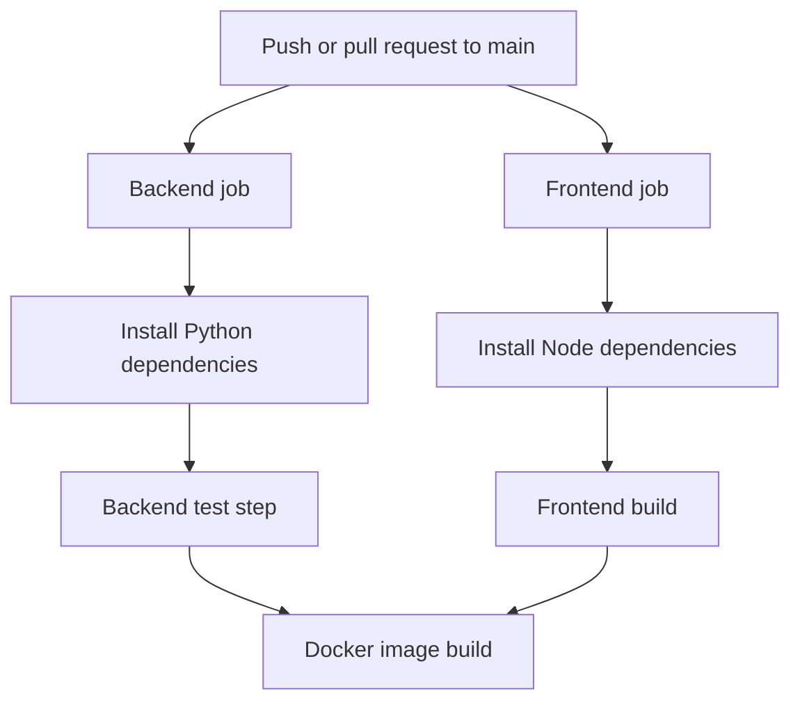

---

## Known Limitations

- The ABDM service is mocked, not connected to the real ABDM gateway.
- The clinical AI output depends on the configured Gemini key and model.
- This is not a medical diagnosis replacement.
- Local JSON files are useful for demo auditability but need stronger access
  control and encryption for production.
- Docker compose uses PostgreSQL, while local default configuration uses SQLite.
- Some legacy route names still say "doctors" while the UI maps hospital data
  into that existing structure.

---

## Future Scope

Possible next improvements:

- Real ABDM consent and health-record integration.
- Role-based access for patient, lender, hospital, and admin users.
- Encrypted storage for sensitive user and loan data.
- More robust hospital dataset ingestion.
- Real lender APIs for loan offers and disbursement.
- Explainable AI report generation for each decision.
- Human doctor review workflow for low-confidence clinical outputs.
- Production observability with request tracing, metrics, and alerts.
- Better fraud analytics using historical pricing trends.
- Multilingual symptom intake for Indian languages.

---

## One-Line Summary

MediRoute AI turns a confusing healthcare payment journey into a guided,
auditable flow: symptoms to procedure, procedure to fair hospital price, and
fair price to responsible financing.
